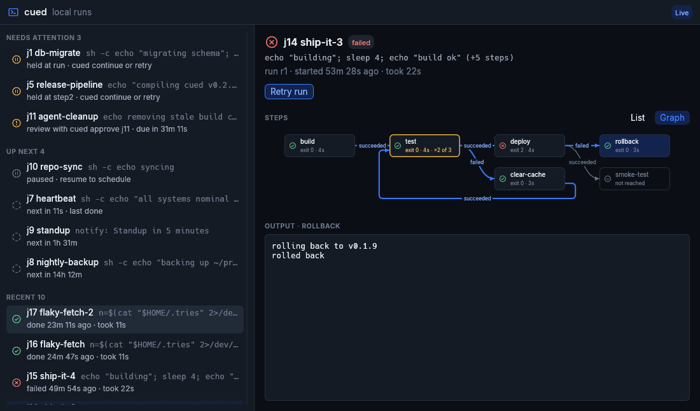

<p align="center">
  <picture>
    <source media="(prefers-color-scheme: dark)" srcset="docs/assets/banner-dark.png">
    
  </picture>
</p>

<p align="center">
  <b>Schedule commands, reminders, and workflows that survive restarts.</b><br>
  A per-user scheduler for Linux, driven from your terminal or by an AI assistant over MCP,<br>
  with an optional desktop window to watch your runs.
</p>

<p align="center">
  <a href="https://github.com/RagingRedRiot/cued/actions/workflows/ci.yml"></a>
  <a href="https://github.com/RagingRedRiot/cued/releases/latest"></a>
  <a href="LICENSE"></a>
  
</p>

<p align="center">
  <a href="#install-and-upgrade"><b>Install</b></a> ·
  <a href="#quick-start"><b>Quick start</b></a> ·
  <a href="#status-window"><b>Status window</b></a> ·
  <a href="docs/cli.md"><b>CLI guide</b></a> ·
  <a href="docs/mcp.md"><b>MCP</b></a> ·
  <a href="DESIGN.md"><b>Design</b></a>
</p>

<p align="center">
  
</p>

- **Survives restarts.** Jobs and workflow positions live in SQLite. After a
  crash, reboot, or upgrade the daemon picks up where it left off, and a run
  that was interrupted is held for your review instead of blindly retried.
- **Workflows, not just timers.** Run steps in order with `cued chain`, or
  write a TOML workflow that branches on exit status, with durable waits
  between steps.
- **Times the way you say them.** `"9am tomorrow"`, `"in 1h"`, `every "day 09:00"`,
  in any IANA time zone. Desktop reminders included.
- **Built for AI assistants.** An MCP server with per-capability policy and
  human approval, and `cued wait`, so an agent can wait on a job without
  spending tokens.
- **A status window, if you want one.** `cued-gui` shows what is running,
  waiting, and done, step by step, like a CI page for your machine, with each
  workflow drawn as a graph of the path it took.
- **Upgrades in place.** `cued upgrade` moves the running daemon onto a new
  build without losing its jobs, socket, or persistence setup.
- **Yours alone.** Runs per user, with no root. Other local users are refused
  by file permissions and by the daemon's kernel peer-credential check.

> [!WARNING]
> Early alpha: commands, storage, and protocols may change without compatibility
> support. Interrupted commands can require human review; cued does not guarantee
> exactly-once external effects.

## Install and upgrade

cued is a daemon and CLI first; the status window is optional. Pick the route
that fits how you'll use it. Each is one download, or one `cargo install`:

| Route | Installs | For |
| --- | --- | --- |
| **Headless** | `cued` | servers, SSH sessions, scripts, AI agents |
| **Desktop** | `cued` and `cued-gui` | a desktop where you want to watch your runs |

Installing and upgrading are the same steps: put the new binaries in place,
then run `cued setup` the first time or `cued upgrade` after that.

### Release download

Checked against their published checksums, for x86_64 Linux.

**Headless:** a single static binary.

```sh
base=https://github.com/RagingRedRiot/cued/releases/latest/download
curl -fLO "$base/cued-x86_64-linux.tar.gz" -O "$base/cued-x86_64-linux.tar.gz.sha256"
sha256sum -c cued-x86_64-linux.tar.gz.sha256
tar -xzf cued-x86_64-linux.tar.gz cued
install -D -m 755 cued ~/.local/bin/cued
cued setup                    # first install; `cued upgrade` when updating
```

**Desktop:** the same `cued`, with the status window.

```sh
base=https://github.com/RagingRedRiot/cued/releases/latest/download
curl -fLO "$base/cued-desktop-x86_64-linux.tar.gz" -O "$base/cued-desktop-x86_64-linux.tar.gz.sha256"
sha256sum -c cued-desktop-x86_64-linux.tar.gz.sha256
tar -xzf cued-desktop-x86_64-linux.tar.gz cued cued-gui
install -D -m 755 -t ~/.local/bin cued cued-gui
cued setup                    # first install; `cued upgrade` when updating
cued-gui --install-desktop    # add cued to your applications list
```

The window needs a Wayland or X11 desktop with OpenGL and glibc 2.35 or newer;
`cued` itself runs on any x86_64 Linux. To add the window to a headless
install later, install the desktop archive over it: its `cued` is the same
binary.

While the repository is private, those URLs need GitHub access; fetch the same
files with `gh release download --repo RagingRedRiot/cued --pattern 'cued-x86_64-*'`
(headless) or `--pattern 'cued-desktop-*'` (desktop). Any directory on your
`PATH` works in place of `~/.local/bin`.

### Cargo

If you have Rust, build and install from source:

```sh
# Headless
cargo install --git https://github.com/RagingRedRiot/cued --locked cued

# Desktop: both in one command (the window needs Rust 1.95 or later)
cargo install --git https://github.com/RagingRedRiot/cued --locked cued cued-gui
```

Then `cued setup`, and for the desktop route `cued-gui --install-desktop`.

### Setup

`setup` offers the persistence backends available on your machine: a systemd user
service, systemd with linger, or cron `@reboot`. Linger can require administrator
approval. Cron starts the daemon after reboot but does not supervise it.
Without setup, the first client starts the daemon on demand.
Use `cued setup --status` to inspect the installation and
`cued setup --uninstall` to remove it.

### Upgrade

`install` and `cargo install` both replace the file rather than write into it,
so the running daemon is untouched until `cued upgrade`. Upgrade `cued` and
`cued-gui` together, and reopen the window after `cued upgrade` so it runs the
new build too. Plain `cp` can't
write over a running binary and fails with "Text file busy".

The daemon stops starting new steps, lets running ones finish, and re-executes
the installed binary in place. Its PID, socket, persistence backend, and store
are kept. Work that came due during the drain runs as soon as the new build is
up. If steps are still running after `--wait` (default `10m`), the upgrade is
abandoned and nothing changes; `--force` interrupts them instead, and they
reconcile per `on_interrupt` as after any restart.

## Quick start

```sh
cued remind "25m" "stretch"                        # a desktop notification
cued every "day 09:00" -- ./backup.sh              # a recurring command
cued chain ./build.sh --then ./test.sh --wait      # steps, then wait for the result
cued list                                          # what's scheduled and how it went
cued logs j3                                       # captured output, step by step
```

`cued wait` exits with the run's outcome (0 done, 3 failed, 4 held, and so
on), so scripts and agents can act on it. A run held after an interruption
can be inspected, then resumed with `cued continue` or rerun with `cued retry`.
The [CLI guide](docs/cli.md) covers waiting, pausing, recovery, and exports;
`cued --help` has every option.

## Status window

<p align="center">
  
</p>

`cued-gui` is a desktop window for your runs, like a CI status page for your
machine. Jobs are grouped by what they need: held runs and approvals first,
then what is running and at which step, what is up next, and how recent runs
ended. Select one to follow its latest run:

- **As a list:** each step in the order it ran, its exit code, timing, and
  the transition it took (`failed → goto rollback`); then the steps still
  ahead, and the branches the run can no longer reach.
- **As a graph:** the workflow drawn left to right, the path taken in bold and
  untaken branches faint. Loops show how often they ran (`×2 of 3` against
  `max_visits`) and turn amber as a step nears its limit.
- **With its output:** each step's log, followed live while it runs.
- **With controls:** continue or retry a held run; pause, resume, or cancel
  the job. Approving a job stays at the terminal.

It follows the daemon's change stream, so it makes no requests and doesn't
redraw while nothing changes. It starts the daemon if none is running, from
the `cued` beside it or on your `PATH` (`--no-auto-start` to leave it
stopped).

The window follows your desktop's light or dark appearance, read from the
freedesktop settings portal, and switches when you change it. It exposes its
controls to screen readers and other assistive technologies through AT-SPI.

## MCP

Configure an AI client to launch `cued` with arguments `["mcp"]`. It serves
`schedule`, `list`, `show`, `cancel`, and `logs` over stdio. Running commands
and sending notifications stay off until you allow them in
`~/.config/cued/mcp.toml`; job status is readable, and captured output is not,
by default:

```toml
exec = "approve"    # open | approve | closed; default closed
notify = "open"     # open | approve | closed; default closed
read = "on"         # list/show; on | off
logs = "off"        # captured output; on | off
```

With `approve`, a job the model schedules does nothing until you run
`cued approve ID` and confirm it. See [MCP](docs/mcp.md) for workflows over
MCP, environment handling, and how agents wait on jobs.

## Reliability and retention

Jobs and workflow positions are stored in SQLite. After downtime, recurring jobs
can catch up once or skip missed firings; they do not replay every missed interval.
Overlapping firings are skipped or coalesced into one queued run.

Notifications are queued durably until delivery or retention cleanup. A crash
between desktop delivery and recording its acknowledgement can cause a duplicate.
A process surviving a daemon crash can also continue its external work; the default
recovery policy holds interrupted runs for review instead of retrying them.

`cued gc` prunes retained history and logs. Defaults keep up to 20 runs per job
and remove terminal runs older than 30 days. Active and held runs are protected.

## Uninstall

```sh
cued uninstall                                # add --purge to remove ~/.config/cued too
rm ~/.local/bin/cued ~/.local/bin/cued-gui    # or `cargo uninstall cued cued-gui`
```

`uninstall` lists what it will delete and asks first: it removes the
persistence backend, stops the daemon (terminating any running steps), and
deletes the store, all job history, logs, and the socket, and the status
window's launcher entry if you installed one. Your config files are kept
unless you pass `--purge`. The binaries are yours to remove, as above. Off
a terminal, `--yes` is required. To keep a job, export it first with
`cued show ID --toml`.

## Development

```sh
cargo test --workspace
cargo clippy --workspace --all-targets -- -D warnings
```

The repository is a Cargo workspace: `cued` at the root, the status window in
`crates/cued-gui`. A plain `cargo build` builds only `cued`, so the CLI and
daemon never compile the window's graphics stack.

The cross-user access test (DESIGN.md §7.1) needs Docker. It runs the daemon
as two real UIDs in a locked-down container and checks that the owner is served
and the other user is refused:

```sh
cargo build --locked && scripts/security/run.sh target/debug/cued
```

CI runs it with fmt, clippy and the test suite (`.github/workflows/ci.yml`).
`controls.yml` fails a pull request that changes workflows, the access fixture,
or existing tests, until a maintainer applies the `reviewed-controls` label to
that revision.

The optional `test-hooks` feature enables fault injection for tests. Leave it off
in installations used for real jobs.

Licensed under the [MIT license](LICENSE).
